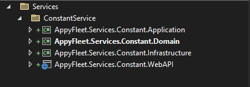
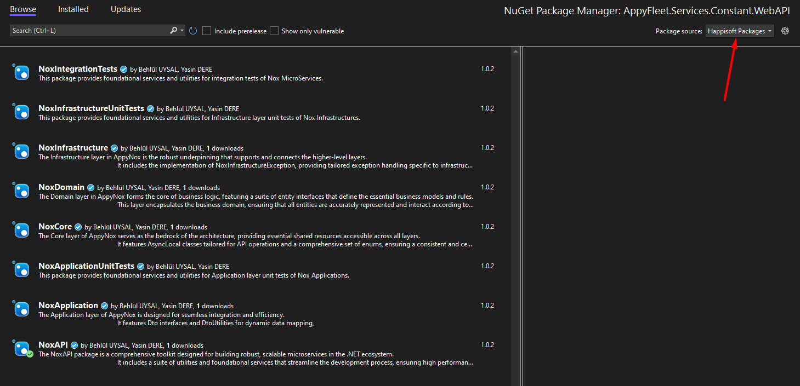
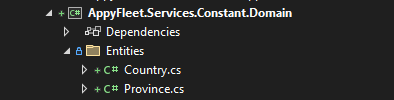
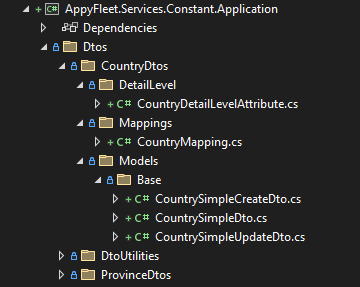
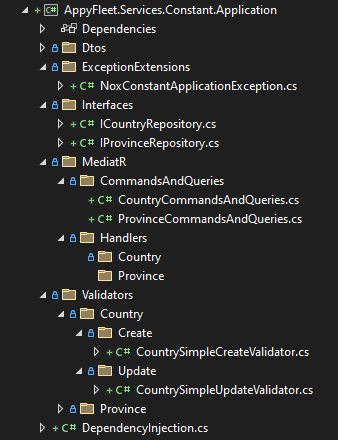
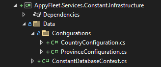
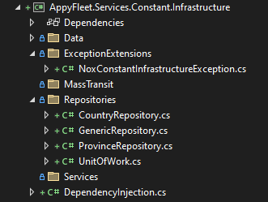
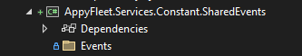
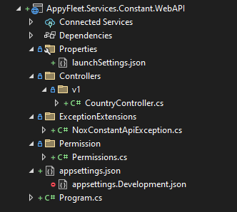

# Adding New Service

In another project, you can follow these steps when creating a new service:

1. **First, open a folder with the new service name in the 'src/Services' directory. Then create Domain, Application, Infrastructure, SharedEvents and WebAPI projects. For example 'Service Name: Constant'. Check out the image below.**

Click to expand the image

 

2. **Install necessary Nox packages for each layer.**

Click to expand the image

 

3. **Create your entities in Domain layer.**

Click to expand the image

 

4. **Create your Dtos and Dto mappings in Application layer.**

Click to expand the image

 

5. **Create other tools and make same structure like below.**

Click to expand the image

 

6. **Create entity configurations and then a DbContext in Infrastructure layer.**

Click to expand the image

 

7. **Create other tools and make same structure like below.**

Click to expand the image

 

8. **Create SharedEvents class library project to use for common events between microservices.**

Click to expand the image

 

9. **Create WebAPI project and make same structure like below.**

Click to expand the image

 