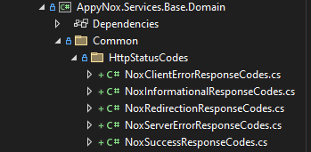
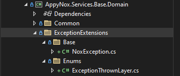

# Exception Handling

<br>

**NoxException**

```NoxException``` is a base Exception class used in AppyNox. In addition to the ```System.Exception``` class, ```NoxException```
contains '```StatusCode```' and '```Title```' properties. Exceptions thrown as ```NoxException``` will be caught by the ```ExceptionHandlingMiddleware```
in ```AppyNox.Services.Base.API```, and the mentioned properties will be used in ```NoxApiException``` before being thrown in ```AutoWrapper.ApiException```.

The '```StatusCode```' and '```Title```' properties are readonly and can only be set from Constructors. It's important to note that ```NoxException``` is an **abstract** class
and cannot be instantiated. So, how do we throw errors? Let's explore:

<br>

**Layer-Based Exceptions**

For each layer in AppyNox's Onion Architecture, we create new classes that inherit from ```NoxException```. For example, ```NoxBaseApplicationException```.
Directly using ```NoxBaseApplicationException``` is not conventional if the thrown error can be grouped and used in other classes. For instance, ```DtoDetailLevelNotFoundException``` is a class inherited from ```NoxBaseApplicationException``` and is used in different classes. Let's take a look at an example:

<br>


```NoxException:```
<details>
  <summary>Click to expand <i>NoxException</i></summary>

```cs
namespace AppyNox.Services.Base.Domain.ExceptionExtensions.Base
{
    public class NoxException : Exception
    {
        #region [ Properties ]

        private readonly string _title = ExceptionThrownLayer.DomainBase.ToString();

        private readonly int _statusCode;

        public int StatusCode
        {
            get => _statusCode;
        }

        public string Title
        {
            get => _title;
        }

        #endregion

        #region [ Public Constructors ]

        public NoxException()
            : base()
        {
            _statusCode = 500;
        }

        public NoxException(string message)
            : base(message)
        {
            _statusCode = 500;
        }

        public NoxException(int statusCode)
            : base()
        {
            _statusCode = statusCode;
        }

        public NoxException(string message, int statusCode)
            : base(message)
        {
            _statusCode = statusCode;
        }

        public NoxException(Enum title, string message, int statusCode)
            : base(message)
        {
            _title = title.GetDisplayName();
            _statusCode = statusCode;
        }

        public NoxException(string message, Exception innerException)
            : base(message, innerException)
        {
            _statusCode = 500;
        }

        public NoxException(string message, int statusCode, Exception innerException)
            : base(message, innerException)
        {
            _statusCode = statusCode;
        }

        #endregion
    }
}
```

</details>

<br>

```NoxApplicationException:```

<details>
  <summary>Click to expand <i>NoxApplicationException</i></summary>

```cs
namespace AppyNox.Services.Base.Application.ExceptionExtensions.Base
{
    public class NoxApplicationException : NoxException
    {
        #region [ Public Constructors ]

        public NoxApplicationException(string message, int statusCode)
            : base(ExceptionThrownLayer.ApplicationBase, message, statusCode)
        {
        }

        #endregion
    }
}
```
</details>

<br>

```AccessTypeNotFoundException:```
<details>
    <summary>Click to expand <i>AccessTypeNotFoundException</i></summary>

```cs
namespace AppyNox.Services.Base.Application.ExceptionExtensions
{
    internal class AccessTypeNotFoundException : NoxApplicationException
    {
        #region [ Internal Constructors ]

        internal AccessTypeNotFoundException(Type entity)
            : base($"This '{entity.FullName}' entity has no access level mapping.", (int)NoxServerErrorResponseCodes.InternalServerError)
        {
        }

        internal AccessTypeNotFoundException(Type entity, string accessType)
            : base($"This '{entity.FullName}' entity has no access level mapping for '{accessType}'.", (int)NoxClientErrorResponseCodes.BadRequest)
        {
        }

        internal AccessTypeNotFoundException(string accessType)
            : base($"'{accessType}' is not a valid Access modifier.", (int)NoxClientErrorResponseCodes.BadRequest)
        {
        }

        #endregion
    }
}
```
</details>

**Important!**
It is important to remember ```ExceptionThrownLayer``` is an enum and should be used in NoxExceptions. Let's look at the response example below:

```json
{
    "version": "1.0",
    "isError": true,
    "responseException": {
        "error": {
            "code": 400,
            "title": "Nox Api Base",
            "message": "'Update' is not a valid Access modifier.",
            "correlationId": "6de450dd-f656-44da-9b50-5640bf8f75bc"
        }
    }
}
```
As it's shown in the example ```"title": "Nox Api Base"``` comes from **ExceptionThrownLayer**.

<br>

**Additional Information**

For the ones who wants to learn where these exceptions are caught and wrapped, check the codes below:

<details>
  <summary>Click to expand <i>ExceptionHandlingMiddleware</i></summary>

```cs
namespace AppyNox.Services.Base.API.Middlewares
{
    public class ExceptionHandlingMiddleware(RequestDelegate next)
    {
        #region Fields

        private readonly RequestDelegate _next = next ?? throw new ArgumentNullException(nameof(next));

        #endregion

        #region Public Methods

        public async Task InvokeAsync(HttpContext context)
        {
            try
            {
                await _next(context);
            }
            catch (NoxException ex)
            {
                string correlationId = (context.Items["CorrelationId"] ?? string.Empty).ToString() ?? string.Empty;
                throw new ApiException(new NoxApiException(ex, correlationId));
            }
        }

        #endregion
    }
}
```
</details>

<br>
<br>
<hr>

**Good to Knows**

- **Http Status Codes are included in the project as enums:** 

    
- **ExceptionThrownLayer enum should be used for every NoxException:** 

     
