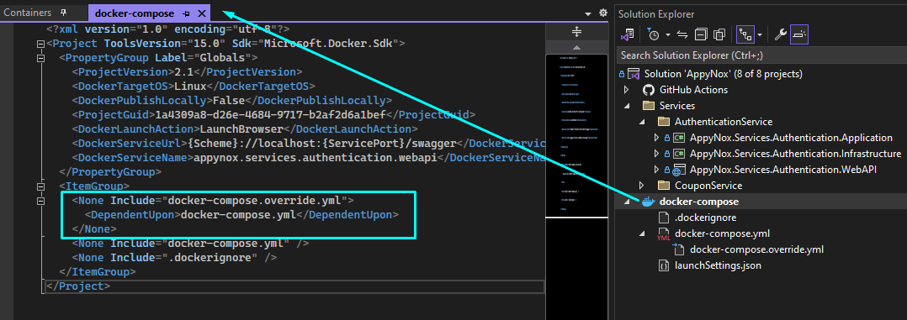

# Installation

<br>

**Prerequisites**

Before you proceed with the installation, make sure you have the following prerequisites installed on your system:

- [Docker Desktop](https://www.docker.com/)
- [PostgreSQL](https://www.postgresql.org/)
- [Visual Studio 2022](https://visualstudio.microsoft.com/)
- [.NET 8](https://dotnet.microsoft.com/en-us/download/dotnet/thank-you/sdk-8.0.100-windows-x64-installer)

1. **Connect Github via SSH** <br>
   Connect your local computer to github via ssh:

```
Check Existing SSH keys (OR) Create a new key

    ->Create a new key
        Open Git Bash
        ssh-keygen -t ed25519 -C "your_email@example.com"
        Enter a file in which to save the key (/c/Users/YOU/.ssh/id_ALGORITHM):[Press enter]
        Enter passphrase (empty for no passphrase): [Type a passphrase]
        Enter same passphrase again: [Type passphrase again]

    ->Check existing keys
        Open Git Bash
        ls -al ~/.ssh
        Check the directory listing to see if you already have a public SSH key. By default, the filenames of supported public keys for GitHub are one of the following.
            id_rsa.pub
            id_ecdsa.pub
            id_ed25519.pub

    ->Adding a new SSH key to your account
        Open Git Bash
        clip < ~/.ssh/id_ed25519.pub (If this not works, use this: cat ~/.ssh/id_ed25519.pub | clip)
        Go to github on your browser
        Click Profil photo > Settings
        In the "Access" section of the sidebar, click  SSH and GPG keys.
        Click New SSH key or Add SSH key.
        In the "Title" field, add a descriptive label for the new key. For example, if you're using a personal laptop, you might call this key "Personal laptop".
        type of key: First, select authentication and then do it for signing again
        In the "Key" field, paste your public key.
        Click Add SSH key.
```

<br>

2. **SSL Certificates** <br>
   After cloning the repository, add development SSL certificates to the services for running them in a Docker container. Run the following commands to generate and trust the SSL certificates:

```bash
dotnet dev-certs https -ep .\src\Services\CouponService\AppyNox.Services.Coupon.WebAPI\ssl\coupon-service.pfx -p happi2023
dotnet dev-certs https -ep .\src\Services\AuthenticationService\AppyNox.Services.Authentication.WebAPI\ssl\authentication-service.pfx -p happi2023
dotnet dev-certs https --trust
```

<br>

3. **docker-compose.override.yml** <br>
   Create a docker-compose.override.yml file (gitignored) to contain connection strings. Fill it with the appropriate content for each service.
   **Example Content:**

```yml
version: "3.4"
services:
  appynox.services.authentication.webapi:
    environment:
      - ASPNETCORE_ENVIRONMENT=Production
      - ASPNETCORE_HTTPS_PORTS=7001
      - ConnectionStrings__DefaultConnection=User ID={your db user};Password={your db password};Server=authentication.db;Port=5432;Database=AppyNox_Authentication;IntegratedSecurity=true;Pooling=true
      - ASPNETCORE_Kestrel__Certificates__Default__Path=/https/authentication-service.pfx
      - ASPNETCORE_Kestrel__Certificates__Default__Password={your certificate password}
    ports:
      - "7001:7001"
    volumes:
      - ${APPDATA}/Microsoft/UserSecrets:/home/app/.microsoft/usersecrets:ro
      - ${APPDATA}/ASP.NET/Https:/home/app/.aspnet/https:ro

  appynox.services.coupon.webapi:
    environment:
      - ASPNETCORE_ENVIRONMENT=Production
      - ASPNETCORE_HTTPS_PORTS=7002
      - ConnectionStrings__DefaultConnection=User ID={your db user};Password={your db password};Server=coupon.db;Port=5432;Database=AppyNox_Coupon;IntegratedSecurity=true;Pooling=true
      - ASPNETCORE_Kestrel__Certificates__Default__Path=/https/coupon-service.pfx
      - ASPNETCORE_Kestrel__Certificates__Default__Password={your certificate password}
    ports:
      - "7002:7002"
    volumes:
      - ${APPDATA}/Microsoft/UserSecrets:/home/app/.microsoft/usersecrets:ro
      - ${APPDATA}/ASP.NET/Https:/home/app/.aspnet/https:ro
```

<br>
<br>

If your docker-compose.override.yml didn't go under docker-compose.yml and located in the same level you can check the following in docker-compose settings:

```
<ItemGroup>
  <None Include="docker-compose.override.yml">
    <DependentUpon>docker-compose.yml</DependentUpon>
  </None>
  <None Include="docker-compose.yml" />
  <None Include=".dockerignore" />
</ItemGroup>
```

<br>



<br>

4. **AppSettings Files** <br>
   Create appsettings.Production.json files for both services. Customize the content with your database and JWT settings.

CouponService appsettings.Production.json :

```json
{
  "Logging": {
    "LogLevel": {
      "Default": "Error",
      "Microsoft.AspNetCore": "Error"
    }
  },
  "ConnectionStrings": {
    "DefaultConnection": "User ID=postgres;Password=sapass;Server=localhost;Port=5432;Database=AppyNox_Coupon;Pooling=true",
    "TestDbConnection": "User ID=postgres;Password=sapass;Server=localhost;Port=5432;Database=AppyNox_Coupon_Test;Pooling=true"
  },
  "JwtSettings": {
    "SecretKey": "vA+A/of8yadsbwe/CmS6PD0Kp837BozrQFMDuQ2Kwwg=",
    "Issuer": "AuthServerV1",
    "Audience": "AppyNoxBasic"
  },
  "ConsulConfig": {
    "Address": "http://localhost:8500"
  },
  "Consul": {
    "ServiceId": "{}",
    "ServiceName": "{}",
    "Scheme": "{http or https}",
    "ServiceHost": "{}",
    "ServicePort": "PORT",
    "Tags": ["Tag1", "Tag2"],
    "HealthCheckUrl": "{health-check-url}",
    "HealthCheckIntervalSeconds": 30,
    "HealthCheckTimeoutSeconds": 5
  }
}
```

<br>

AuthenticationService appsettings.Production.json:

```json
{
  "Logging": {
    "LogLevel": {
      "Default": "Information",
      "Microsoft.AspNetCore": "Warning"
    }
  },
  "ConnectionStrings": {
    "DefaultConnection": "User ID=postgres;Password=auth_password;Server=authentication.db;Port=5432;Database=AppyNox_Authentication;IntegratedSecurity=true;Pooling=true"
  },
  "JwtSettings": {
    "SecretKey": "{your secret key}",
    "Issuer": "AuthServerV1",
    "Audience": "AppyNoxBasic"
  }
}
```

<br>

5. **Services you need to run on Docker container:**

```
    RabbitMQ
        - docker pull rabbitmq
        - docker run -d --name rabbitmq.service -p 5672:5672 -p 15672:15672 rabbitmq:management
        - Open your browser and go to http://localhost:15672. The username will be guest and the password will be guest (default values).

    Consul
        - docker pull hashicorp/consul:latest
        - docker run -d --name=consul.service -p 8500:8500 hashicorp/consul agent -dev -client=0.0.0.0 -bind=0.0.0.0
        - Go to http://localhost:8500
        - Finally, you need to add the following block to the appsettings file of the microservice that will register to the consul service:
            "ConsulConfig": {
              "Address": "http://localhost:8500"
            },
            "Consul": {
              "ServiceId": "{}",
              "ServiceName": "{}",
              "Scheme": "{http or https}",
              "ServiceHost": "{}",
              "ServicePort": {PORT},
              "Tags": [ "Tag1", "Tag2" ],
              "HealthCheckUrl": "{health-check-url}",
              "HealthCheckIntervalSeconds": 30,
              "HealthCheckTimeoutSeconds": 5
            }
```

<br>

6. With everything set up, select Docker as the startup project and run the solution. This will launch the AppyNox services in Docker containers.
   <br>
   <br>

**These steps ensure a smooth setup for AppyNox services. Adjust the configurations based on your specific requirements.**
