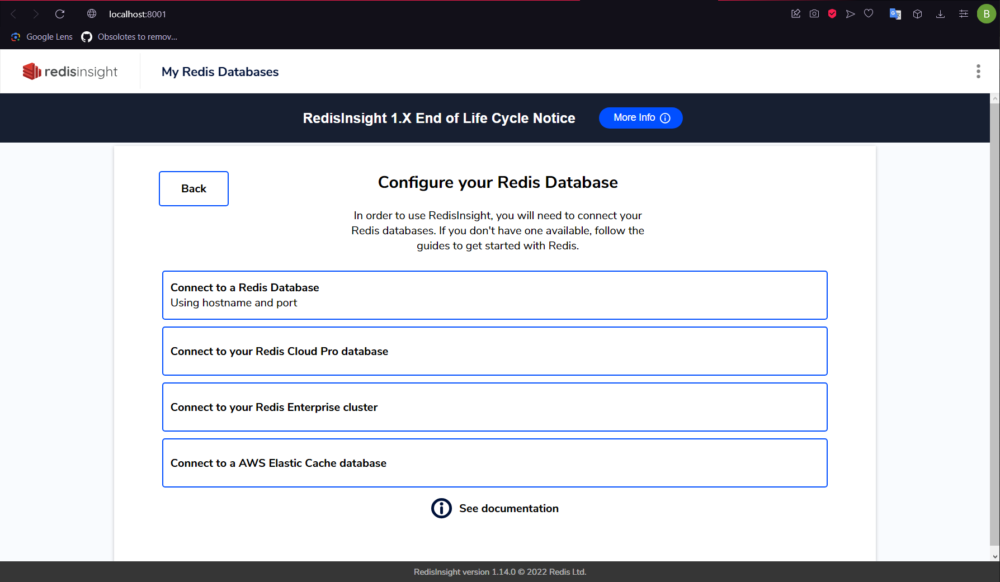
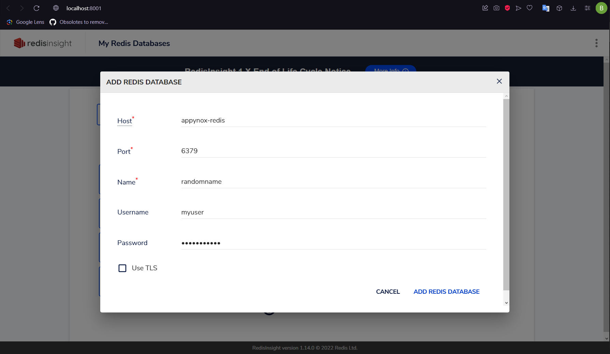

# Redis

1. **Acl File**

    Create ```redis.acl``` at the root of the solution.

2. **Acl Content**

    Open the created folder and fill the inside with:

```acl
user myuser on >mypassword allcommands allkeys
```
Note that ```myuser``` is username, ```mypassword``` is password. Change these respectively.


## Redis Insight 

You can reach ```redisinsight``` after you run the AppyNox from dockerfile, if you have included the .development too with the following command:


```bash
docker-compose -f docker-compose.yml -f docker-compose.Development.yml up
```

```http://localhost:8001``` is the default port for redisinsight in ```docker-compose.Development.yml```.

<br>

1. **Connection to Redis**

<details>
    <summary>Click to expand the image</summary>

**Choose ```I already have a database```**

 

</details>

<br>

2. **Step Two**

<details>
    <summary>Click to expand the image</summary>

**Choose ```Connect to a Redis Database```**

 

</details>    

<br>

3. **Step Three**

<details>
    <summary>Click to expand the image</summary>

**Fill the content as below. Use your usename and password from ```redis.acl```**



</details> 

<br>

4. **Step Four**

<details>
    <summary>Click to expand the image</summary>

**You can access the Redis cache now**


</details> 

<br>
<br>
<br>

# Read Also

- [Redis GitHub Configuration](github.md#add-acl-to-github-for-workflow)