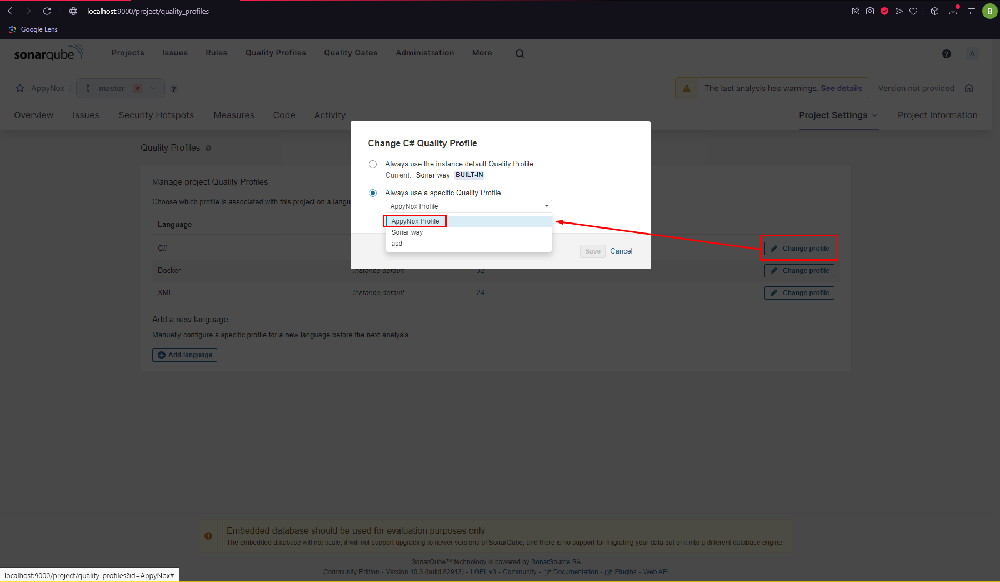

# SonarQube

**Sonar Instalation and Setup Steps**

1. **Creating Sonar instance in Docker**

<details>
    <summary>Click to expand docker-compose.yml for Sonar</summary>

```yml
version: "3.4"
services:
  sonarqube:
    image: sonarqube
    environment:
      - SONARQUBE_JDBC_USERNAME=sonarqube
      - SONARQUBE_JDBC_PASSWORD=sonarpass
      - SONARQUBE_JDBC_URL=jdbc:postgresql://db:5432/sonarqube
    ports:
      - "9000:9000"
      - "9092:9092"
    depends_on:
      - db
    volumes:
      - sonarqube_conf:/opt/sonarqube/conf
      - sonarqube_extensions:/opt/sonarqube/extensions
      - sonarqube_bundled-plugins:/opt/sonarqube/lib/bundled-plugins

  db:
    image: postgres
    environment:
      - POSTGRES_USER=sonarqube
      - POSTGRES_PASSWORD=sonarpass
      - POSTGRES_DB=sonarqube
    volumes:
      - postgresql_data:/var/lib/postgresql/data

volumes:
  postgresql_data:
  sonarqube_bundled-plugins:
  sonarqube_conf:
  sonarqube_extensions:
```

</details>

After creating `docker-compose.yml` in a folder run `docker-compose up` in terminal and create SonarQube instance in Docker.

2. **Go to `http://localhost:9000` and login.**

Login credentials: - username: admin - password: admin

3. **Setup Authentication**

Go to Administration->Authentication->Github->Create Configuration to create a new configration.

  <details>
    <summary>Click to expand the image</summary>


  </details>

Go to settings following the image above and create a new configuration. Details should be obtained from another developer since it contains confidential information. If you have permission you can get the necessary data from HappiSoft Discord channel, `💼-data-streams` channel.

4. **Create a new project**

Go to Projects->"Create a local project" and create a new project.

<details>
<summary>Click to expand the image</summary>


  </details>

Project name should be **repository name** and **Main branch name** should be **master**. Choose **Use the global setting** at the second page and continue. Choose `Locally` after project creation and create a token. Click continue and choose `.NET`.

5. **Install `dotnet-sonarscanner`**

```bash
dotnet tool install --global dotnet-sonarscanner
```

6. **Execute the Scanner Bash Commads**

In the SonarQube page you will see 3 steps. You should note these 3 bash commands for future use. Example:

```bash
dotnet sonarscanner begin /k:"AppyNox" /d:sonar.host.url="http://localhost:9000"  /d:sonar.token="{your-key}"

dotnet build .\AppyNox.sln

dotnet sonarscanner end /d:sonar.token="{your-key}"
```

7. **Execution**

Last thing you need to do is go to `AppyNox` directory and run the bash commands above.

<br>
<br>
<br>

# Advanced

<details>
  <summary>Create New Quality Profile</summary>

1. **Create New Quality Profile**
   Navigate to `Quality Profiles > Create > 'Copy an existing quality profile'`. Choose language and select Parent as 'Sonar Way (Built-in)'.

<details>
  <summary>Expand to see steps in images</summary>


</details>

</details>

<br>
<br>

<details>
  <summary>Change Quality Profile of Project</summary>

1. **Navigate to Project Profile**
   Navigate to `'YourProject' > 'Project Settings' > 'Quality Profiles'`.
2. **Change Profile**
   Click 'Change Profile' for the language you want to change the profile. Choose the profile you want to be active for the project and confirm.

<details>
  <summary>Expand to see steps in images</summary>




</details>

</details>

<br>
<br>

<details>
  <summary>Remove rules</summary>

1. **Create New Quality Profile**
   Navigate to `Quality Profiles > Create > 'Copy an existing quality profile'`. Choose language and select Parent as 'Sonar Way (Built-in)'.
2. **Deactivate Rule**
   Go to Quality Profile > active rules > choose the rule you want to deactivate > 'Bulk Change' > 'Deactivate in 'ProfileName''

<details>
  <summary>Expand to see steps in images</summary>


</details>

</details>

<br>
<br>

<details>
  <summary>Exclude Migrations</summary>

1. **Add Exclude Rule**
   Navigate to `Project Settings > Analysis Scope > Ignore Issues on Files >` add Regular expression: `.*/Migrations/.*`

<details>
  <summary>Expand to see steps in images</summary>


</details>

</details>

<br>
<br>

**Rules to remove**

- csharpsquid:S3604
